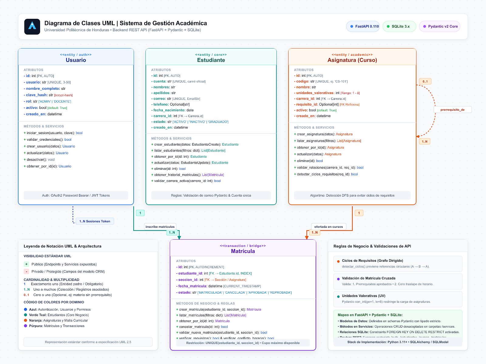

# Diagrama UML - Sistema de Gestión de Matrículas

## ¿Qué es este diagrama?

Este es un **diagrama UML (Unified Modeling Language)** que muestra cómo funciona la estructura del sistema de gestión académica. Es básicamente el "plano" de cómo están organizadas las tablas en la base de datos y qué operaciones puede hacer cada una.

---



## Las 4 Clases Principales

### 1. **Usuario** 🔐
**¿Para qué sirve?**
Guarda la información de los que pueden acceder al sistema (administradores y docentes).

**Qué información guarda:**
- `id`: número único para identificar a cada usuario
- `usuario`: nombre de usuario (como "admin" o "docente123")
- `nombre_completo`: nombre real de la persona
- `clave_hash`: contraseña encriptada (no se guarda en texto plano)
- `rol`: si es ADMIN (máximo control) o DOCENTE (acceso limitado)
- `activo`: si el usuario puede usar el sistema o está desactivado
- `creado_en`: cuándo se creó la cuenta

**Qué puede hacer (métodos):**
- `iniciar_sesion()` - Verificar usuario y contraseña
- `validar_credenciales()` - Comprobar que sea válido
- `crear_usuario()` - Agregar un nuevo usuario al sistema
- `actualizar()` - Cambiar datos del usuario
- `desactivar()` - Bloquear una cuenta sin borrarla
- `obtener_por_id()` - Buscar un usuario por su ID

---

### 2. **Estudiante** 👤
**¿Para qué sirve?**
Almacena todos los datos de los estudiantes que se matriculan en cursos.

**Qué información guarda:**
- `id`: número único del estudiante
- `cuenta`: código de estudiante (ejemplo: "20261001")
- `nombres` y `apellidos`: nombre completo
- `correo`: email institucional
- `telefono`: número de contacto (opcional)
- `fecha_nacimiento`: cuándo nació
- `carrera_id`: qué carrera está estudiando (Ingeniería, Administración, etc.)
- `estado`: si está ACTIVO (puede matricularse), INACTIVO o ya GRADUADO
- `creado_en`: cuándo se registró

**Qué puede hacer (métodos):**
- `crear_estudiante()` - Registrar un nuevo estudiante
- `listar_estudiantes()` - Ver todos los estudiantes (con filtros)
- `obtener_por_id()` - Buscar un estudiante específico
- `actualizar()` - Cambiar datos del estudiante
- `eliminar()` - Borrar un estudiante (si no tiene historial)
- `obtener_historial_matriculas()` - Ver todos los cursos donde se ha matriculado
- `validar_carrera_activa()` - Comprobar que la carrera esté disponible

---

### 3. **Asignatura** (Curso) 📚
**¿Para qué sirve?**
Define todos los cursos/materias que ofrece la universidad.

**Qué información guarda:**
- `id`: número único del curso
- `codigo`: código único (ejemplo: "IS-110" para Programación I)
- `nombre`: nombre del curso
- `unidades_valorativas`: créditos del curso (entre 1 y 8)
- `carrera_id`: a cuál carrera pertenece este curso
- `requisito_id`: qué curso debes aprobar antes de tomar este (puede ser nulo si no hay requisito)
- `activo`: si se está ofreciendo o no
- `creado_en`: cuándo se agregó

**Qué puede hacer (métodos):**
- `crear_asignatura()` - Agregar un nuevo curso
- `listar_asignaturas()` - Ver todos los cursos disponibles
- `obtener_por_id()` - Buscar un curso específico
- `actualizar()` - Cambiar información del curso
- `eliminar()` - Borrar un curso
- `validar_relaciones()` - Comprobar que el requisito sea válido
- `detectar_ciclos_requisitos()` - Evitar que un curso sea requisito de sí mismo (ejemplo: no puedes requerir "Programación II" para "Programación I" si "Programación II" requiere "Programación I")

---

### 4. **Matrícula** ✍️
**¿Para qué sirve?**
Es el registro de que un estudiante se inscribió en un curso específico. Es la conexión entre estudiantes y cursos.

**Qué información guarda:**
- `id`: número único de la matrícula
- `estudiante_id`: quién se matriculó
- `seccion_id`: en cuál sección/grupo del curso (mismo curso, diferente horario)
- `fecha_matricula`: cuándo se matriculó
- `estado`: si está MATRICULADA (activa), CANCELADA (se salió), APROBADA (pasó) o REPROBADA (no pasó)

**Qué puede hacer (métodos):**
- `crear_matricula()` - Inscribir a un estudiante en un curso
- `listar_matriculas()` - Ver todas las inscripciones (con filtros)
- `obtener_por_id()` - Buscar una matrícula específica
- `cancelar_matricula()` - Que el estudiante se salga del curso
- `validar_nueva_matricula()` - Verificar que el estudiante pueda matricularse (requisitos, cupo disponible, etc.)
- `verificar_requisitos()` - Comprobar que ya aprobó los cursos previos
- `verificar_conflicto_horario()` - Asegurar que no tenga dos cursos al mismo tiempo

---

## Cómo se relacionan las clases

```
Usuario (1) --------- (N) Sistema de acceso
  ↓
  └─→ Un usuario puede iniciar sesión muchas veces

Estudiante (1) --------- (N) Matrículas
  ↓
  └─→ Un estudiante puede matricularse en muchos cursos

Asignatura (1) --------- (N) Matrículas
  ↓
  └─→ Un curso puede tener muchos estudiantes matriculados

Asignatura (0..1) ← → (N) Asignatura
  ↓
  └─→ Un curso puede tener un requisito previo (otro curso)
```

### Relación clave: Estudiante ↔ Matrícula ↔ Asignatura

Es el corazón del sistema:
1. El **Estudiante** quiere matricularse en una **Asignatura**
2. Se crea un registro de **Matrícula** que conecta a ambos
3. El sistema verifica que el estudiante cumpla requisitos
4. Si todo está bien, la matrícula se aprueba

---

## Notación UML utilizada

En el diagrama encontrarás estos símbolos:

| Símbolo | Significado |
|---------|-------------|
| `+` | Método público (todos pueden usarlo) |
| `-` | Método privado (solo la clase lo usa) |
| `#` | Método protegido (la clase y sus herederas) |
| `1` | Uno (una clase está relacionada con una sola de la otra) |
| `N` o `*` | Muchos (una clase puede relacionarse con varias de la otra) |
| `0..1` | Cero o uno (opcional) |
| Flecha → | Relación de dependencia o herencia |

---

## Validaciones importantes

### En Usuario:
- ✓ El nombre de usuario debe ser único
- ✓ La contraseña se encripta con SHA256
- ✓ Solo ADMIN y DOCENTE son roles válidos
- ✓ No se puede usar un usuario inactivo para acceder

### En Estudiante:
- ✓ El correo y la cuenta deben ser únicos
- ✓ La fecha de nacimiento no puede ser en el futuro
- ✓ La carrera debe estar activa
- ✓ No se puede eliminar si tiene matrículas históricas

### En Asignatura:
- ✓ El código debe ser único
- ✓ Un curso no puede ser requisito de sí mismo
- ✓ Los requisitos no pueden formar ciclos (A requiere B, B requiere A)
- ✓ La carrera debe existir

### En Matrícula:
- ✓ El estudiante debe estar activo
- ✓ El curso debe estar disponible
- ✓ El estudiante debe haber aprobado los requisitos
- ✓ No puede haber dos cursos al mismo tiempo (conflicto de horario)
- ✓ Máximo 20 unidades valorativas por período

---

## ¿Por qué está organizado así?

Este diseño sigue las reglas de **bases de datos relacionales**:

1. **Cada tabla (clase) tiene su propia responsabilidad**
   - Usuario → Autenticación
   - Estudiante → Datos académicos personales
   - Asignatura → Catálogo de cursos
   - Matrícula → Registro de inscripciones

2. **Las relaciones evitan duplicar información**
   - No repetimos el nombre del estudiante en cada matrícula
   - Solo guardamos su `estudiante_id` (número)
   - Si necesitamos el nombre, buscamos en la tabla Estudiante

3. **Las validaciones aseguran que los datos sean correctos**
   - No puede un estudiante inactivo matricularse
   - No puede haber ciclos en requisitos
   - No puede haber conflictos de horario

---

## Cómo se usa en el código

En el proyecto FastAPI, estas clases se implementan como:

1. **Esquemas Pydantic** (en `schemas.py`)
   ```python
   class EstudianteEntrada(BaseModel):
       cuenta: str
       nombres: str
       apellidos: str
       correo: EmailStr
       # ... más campos
   ```

2. **Funciones en routers** (en `routers/estudiantes.py`)
   ```python
   @router.post("/estudiantes", response_model=EstudianteRespuesta)
   def crear_estudiante(datos: EstudianteEntrada):
       # Aquí va el método crear_estudiante()
   ```

3. **Tablas SQL** (en `database.py`)
   ```sql
   CREATE TABLE estudiantes (
       id INTEGER PRIMARY KEY,
       cuenta TEXT NOT NULL UNIQUE,
       nombres TEXT NOT NULL,
       -- ... más columnas
   );
   ```

---

## Resumen

Este UML es el **blueprint** (plano) de cómo está estructurado el sistema. Dice:
- Qué datos guardamos (atributos)
- Qué operaciones podemos hacer (métodos)
- Cómo se relacionan las tablas (relaciones)
- Qué reglas deben cumplir (validaciones)


---

**Creado por:** [Kevin Hernandez]  
**Fecha:** 28 Septiembre 2026  
**Curso:** Programación III - Universidad Politécnica de Honduras